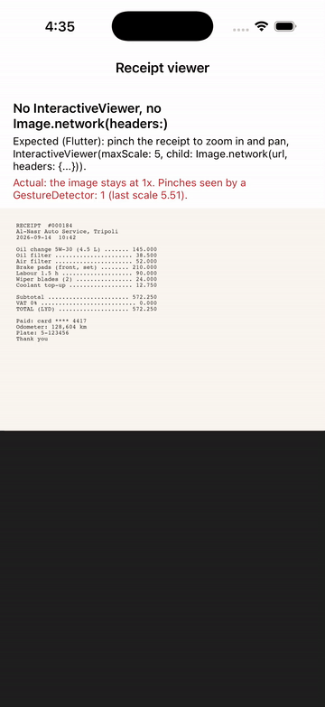

# Repro: no InteractiveViewer (pinch-zoom/pan) and no Image.network(headers:)

Issue: https://github.com/DartNative/dartnative/issues/62

DartNative 1.0.0 has no `InteractiveViewer` (or any other pinch-zoom/pan container), and `Image.network` takes no `headers`. Apps that show photos of receipts and invoices need zoom to read them, and attachments behind auth need an `Authorization` header, so today an app downloads the file through its own HTTP client and shows it with `Image.file`, without zoom.

## Run

`dn run` (iOS simulator; Android behaves the same unless stated).

## What you'll see

A receipt image (bundled asset `assets/receipt.png`) fills the lower part of the screen, with the title, an "Expected (Flutter)" line and an "Actual" line above it.

1. Pinch out on the receipt with two fingers (in the simulator: hold Option and drag).
2. The image does not zoom or pan. The "Actual" line counts the pinches a plain `GestureDetector(onScaleUpdate:)` around the image saw, to show the gesture reached the app: in the recording it goes from 0 to 1 (last scale 5.51) while the receipt stays at 1x.

## Expected

As in Flutter: the receipt zooms up to `maxScale` and can be panned while zoomed; `Image.network` sends the given headers with the request.

## What we'd write in Flutter

```dart
InteractiveViewer(
  minScale: 1,
  maxScale: 5,
  child: Image.network(
    'https://api.example.com/files/receipt-184.jpg',
    headers: {'Authorization': 'Bearer $token'},
    fit: BoxFit.contain,
  ),
)
```

`dn analyze` on 1.0.0:

```
error • The function 'InteractiveViewer' isn't defined • undefined_function
error • The named parameter 'headers' isn't defined • undefined_named_parameter
```

## Recording



[recording/ios.mp4](recording/ios.mp4) · [screenshot](recording/ios.png)

## Environment

- DartNative 1.0.0 (SDK `113c27aacb2`, framework edition `7ae29132`), Dart 3.12.0
- macOS 26.7.1, Xcode 26.1.1
- iPhone 17 simulator, iOS 26.1
